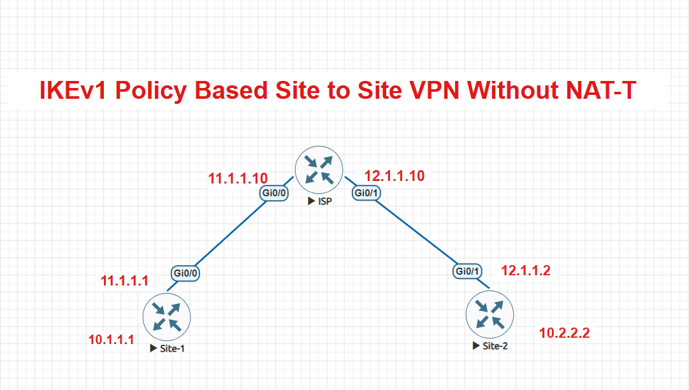

# 🔐 SITE-TO-SITE IPsec VPN — WITHOUT NAT-T

## 📌 Project Overview

This project demonstrates a **policy-based Site-to-Site IPsec VPN** between two sites through an ISP network.

The VPN provides secure communication between the private LAN networks of Site-1 and Site-2.

The project demonstrates:

- IKEv1 negotiation
- ISAKMP
- Pre-shared key authentication
- IPsec
- ESP encryption
- Extended ACL
- Crypto Map
- Site-to-Site VPN
- VPN verification
- Wireshark packet analysis
- VPN operation without NAT-T

---

# 🏗️ 1. VPN Network Topology

The following topology represents the Site-to-Site VPN environment.

Site-1 and Site-2 communicate through an ISP router. The VPN tunnel is established between the two VPN endpoint routers.



### 🔎 Topology Description

```text
Site-1 LAN
    |
Site-1 Router
    |
    | WAN
    |
ISP Router
    |
    | WAN
    |
Site-2 Router
    |
Site-2 LAN
